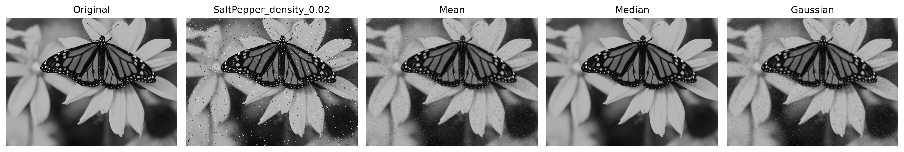
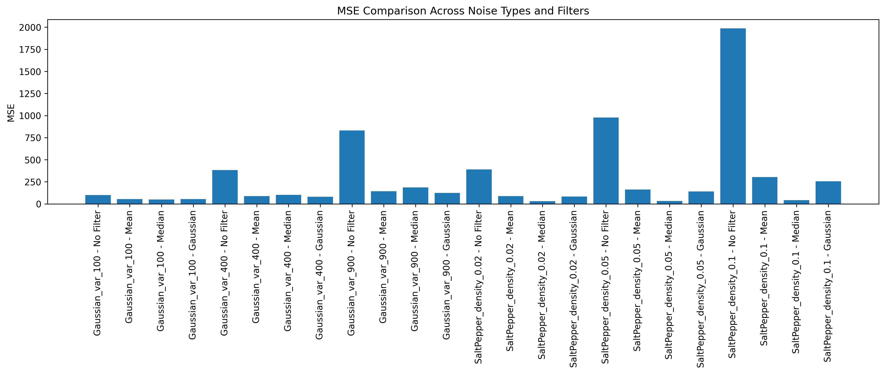
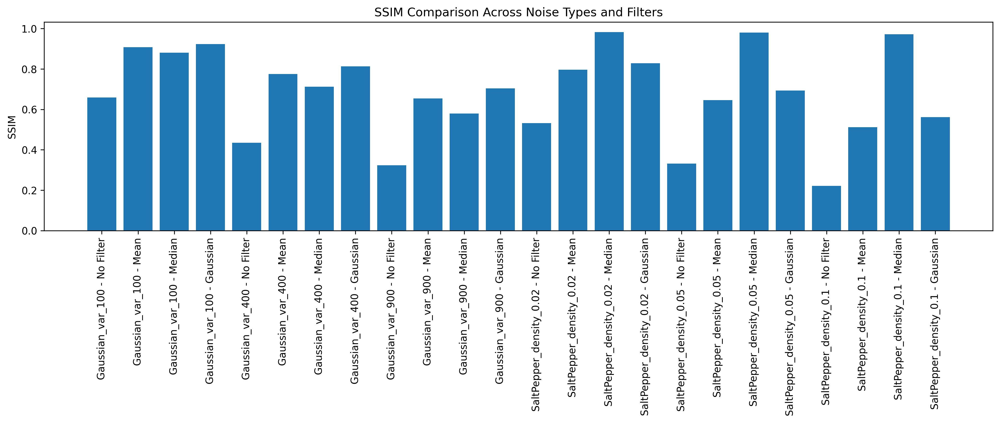
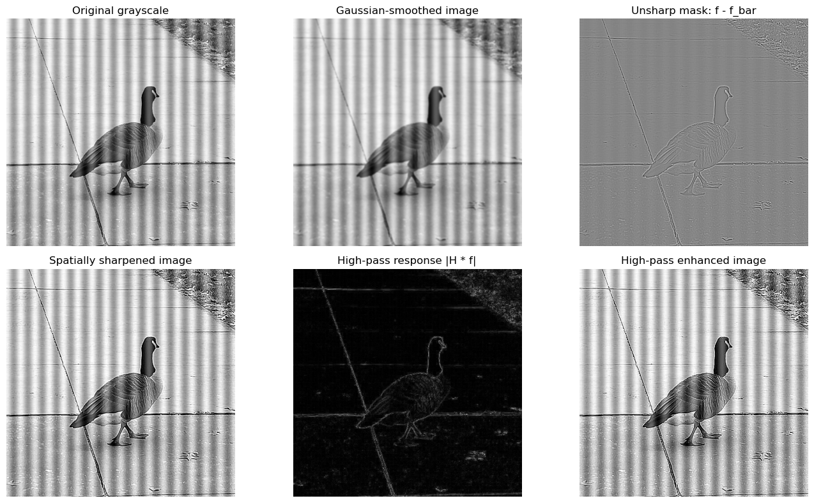
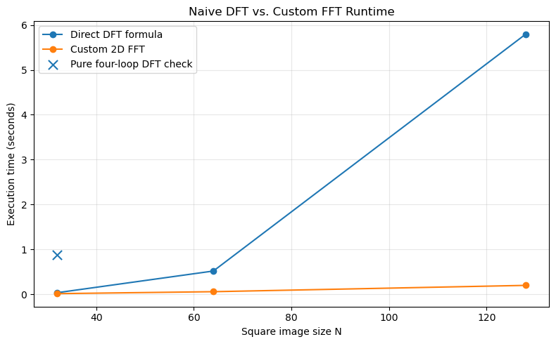
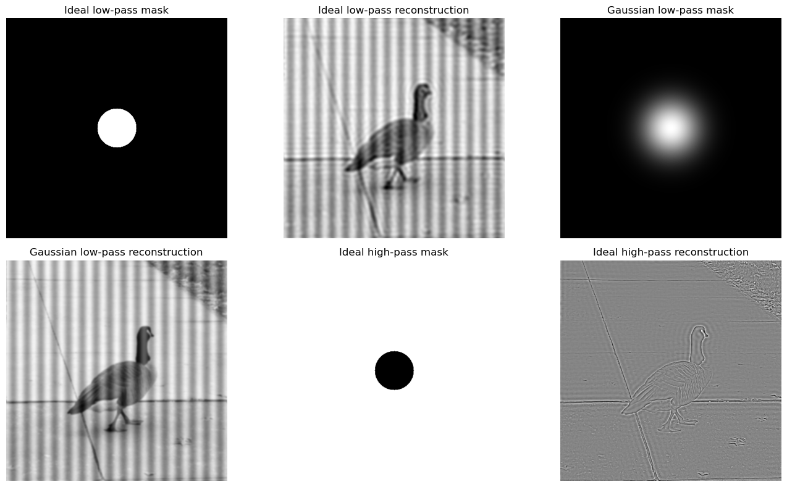

# Classical Image Processing: Edge Detection, Restoration, and Frequency Analysis

## Overview

This repository contains a classical Digital Image Processing (DIP) project focused on image enhancement, edge detection, image restoration, and frequency-domain analysis.

The project implements the three tasks from `DIP-HW2.pdf` using Jupyter notebooks:

- **Task 1:** Edge detection and multi-scale Canny analysis.
- **Task 2:** Noise modeling and image restoration.
- **Task 3:** Spatial and frequency-domain image enhancement.

This is a **digital image processing and numerical computing project**, not a machine learning or deep learning training project. The notebooks emphasize manual implementations of core algorithms using NumPy and related scientific Python tools.

## Key Features

- Implements Sobel, Prewitt, Roberts, Laplacian edge detection, Laplacian sharpening, and a manual Canny pipeline.
- Evaluates edge maps against ground-truth boundary annotations using precision, recall, F1 score, and localization error.
- Simulates Gaussian noise and Salt & Pepper noise at multiple intensity levels.
- Implements mean, median, and Gaussian restoration filters from scratch.
- Computes MSE and SSIM manually for image-restoration evaluation.
- Implements manual convolution, naive 2D DFT, recursive FFT/IFFT, frequency filters, and spectral-energy metrics.
- Includes saved visual outputs and a technical report with quantitative results.

## Project Highlights

- Built a multi-part classical image-processing workflow covering spatial filtering, restoration, edge detection, and frequency-domain enhancement.
- Implemented core algorithms manually instead of relying on high-level OpenCV, SciPy signal-processing, or NumPy FFT functions.
- Compared visual and quantitative behavior across edge detectors, restoration filters, and frequency-domain filters.
- Organized reproducible notebooks with saved figures and a final PDF report suitable for academic review or portfolio presentation.

## Dataset

The repository uses local image files stored under `images/`. The project does not include tabular data.

### Task 1: Edge Detection Dataset

| Item | Description |
| --- | --- |
| Dataset files | `images/Task_1_Edge_Detection/100007.jpg`, `69007.jpg`, and matching `.mat` ground-truth files |
| Dataset type | Natural images with boundary/edge annotations |
| Input format | RGB/JPEG images converted to grayscale |
| Label format | MATLAB `.mat` files containing ground-truth boundary maps |
| Features | Pixel intensity values after grayscale conversion |
| Targets | Binary ground-truth edge/boundary maps |
| Train/test split | Not specified in the current project files. The repository uses two provided images for evaluation. |
| Preprocessing | Grayscale conversion, padding for convolution, Otsu thresholding for edge binarization |

The image IDs and `.mat` ground-truth structure match the Berkeley Segmentation Dataset style. The official Berkeley resources describe BSDS500 as a dataset of 500 natural images with human annotations and benchmark code:

- [UC Berkeley Computer Vision Group: BSDS500 resources](https://www2.eecs.berkeley.edu/Research/Projects/CS/vision/grouping/resources.html)
- [Berkeley Segmentation Dataset and Benchmark](https://www2.eecs.berkeley.edu/Research/Projects/CS/vision/grouping/segbench/)

### Task 2: Image Restoration Inputs

| Item | Description |
| --- | --- |
| Dataset files | `images/Task_2_Image_Restoration/grayscale.jpg`, `5226523_orig.jpg`, `kP0u2.png` |
| Dataset type | Local/custom grayscale image inputs |
| Main input used | `./images/Task_2_Image_Restoration/grayscale.jpg` |
| Input format | Image file loaded with Pillow and converted to grayscale |
| Labels/targets | The clean grayscale image is used as the restoration reference |
| Train/test split | Not specified in the current project files. |
| Preprocessing | Grayscale conversion, conversion to `float64`, clipping to `[0, 255]` |
| Transformations | Gaussian noise with variances `100`, `400`, `900`; Salt & Pepper noise with densities `0.02`, `0.05`, `0.10` |

The original source of these local images is not specified in the current project files.

### Task 3: Image Enhancement Inputs

| Item | Description |
| --- | --- |
| Dataset files | `images/Task_3_Image_Enhancement/noise.jpg`, `noise2.jpg`, `pnois1.jpg` |
| Dataset type | Local/custom images for enhancement and frequency analysis |
| Main input used | `images/Task_3_Image_Enhancement/pnois1.jpg` |
| Input format | Image files loaded with Pillow; RGB images converted to grayscale |
| Labels/targets | Not specified in the current project files. |
| Train/test split | Not specified in the current project files. |
| Preprocessing | Grayscale conversion, resizing/cropping for DFT/FFT benchmarks, clipping and normalization for display |

The original source of these local images is not specified in the current project files.

## Project Structure

```text
HW2/
├── images/
│   ├── Task_1_Edge_Detection/
│   │   ├── 100007.jpg
│   │   ├── 100007.mat
│   │   ├── 69007.jpg
│   │   └── 69007.mat
│   ├── Task_2_Image_Restoration/
│   │   ├── 5226523_orig.jpg
│   │   ├── grayscale.jpg
│   │   └── kP0u2.png
│   └── Task_3_Image_Enhancement/
│       ├── noise.jpg
│       ├── noise2.jpg
│       └── pnois1.jpg
├── figures/
│   ├── original_image.png
│   ├── mse_plot.png
│   ├── ssim_plot.png
│   └── ...
├── img/
│   ├── edge operators polar.png
│   ├── canny city.png
│   ├── task3_runtime_benchmark.png
│   └── ...
├── task3_outputs/
├── Task 1.ipynb
├── Task 2.ipynb
├── Task 3.ipynb
├── DIP-HW2.pdf
├── HW2-Report.pdf
├── Archive.zip
├── requirements.txt
├── .gitignore
└── README.md
```

### Important Files and Folders

- `Task 1.ipynb`: edge detection, Canny pipeline, noise robustness, and boundary evaluation.
- `Task 2.ipynb`: noise generation, restoration filters, MSE/SSIM evaluation, and restoration plots.
- `Task 3.ipynb`: spatial sharpening, manual DFT/FFT/IFFT, frequency filtering, and spectral metrics.
- `images/`: input images and Task 1 ground-truth `.mat` files.
- `figures/`: saved Task 2 restoration outputs and metric plots.
- `img/`: saved Task 1 and Task 3 visual outputs used by the report and README.
- `DIP-HW2.pdf`: original homework specification.
- `HW2-Report.pdf`: final technical report with visualizations and quantitative analysis.
- `Archive.zip`: submission archive containing the report and notebooks. It is useful for submission history but can be omitted from a clean GitHub release if desired.
- `task3_outputs/`: output directory created by the Task 3 notebook. It currently contains only `.gitkeep` so the folder is preserved on GitHub.

## Methodology / Workflow

### Task 1: Edge Detection and Multi-Scale Canny

1. Load image/ground-truth pairs from `images/Task_1_Edge_Detection/`.
2. Convert RGB images to grayscale.
3. Apply manual convolution with zero or edge-replication padding.
4. Compute edge responses using:
   - Sobel gradients
   - Prewitt gradients
   - Roberts Cross gradients
   - Laplacian edge response
   - Laplacian sharpening
5. Binarize edge responses using Otsu thresholding.
6. Implement the Canny pipeline manually:
   - Gaussian smoothing
   - Sobel gradient magnitude and direction
   - non-maximum suppression
   - hysteresis thresholding
7. Evaluate detected edges against ground truth using precision, recall, F1 score, and localization error.
8. Add Gaussian noise and compare Sobel and Canny robustness.

### Task 2: Noise Modeling and Image Restoration

1. Load `images/Task_2_Image_Restoration/grayscale.jpg`.
2. Convert the image to grayscale `float64`.
3. Generate noisy images:
   - Gaussian noise with variances `100`, `400`, and `900`
   - Salt & Pepper noise with densities `0.02`, `0.05`, and `0.10`
4. Restore each noisy image using manually implemented:
   - mean filter
   - median filter
   - Gaussian filter
5. Evaluate each restored image using:
   - Mean Squared Error (MSE)
   - Structural Similarity Index Measure (SSIM)
6. Record execution time for each filter.
7. Save selected output images and metric plots.

### Task 3: Spatial and Frequency-Domain Enhancement

1. Load images from `images/Task_3_Image_Enhancement/`.
2. Use `pnois1.jpg` as the main 512 x 512 grayscale input for FFT compatibility.
3. Apply spatial-domain enhancement:
   - Gaussian smoothing
   - unsharp masking
   - direct high-pass convolution
4. Implement frequency-domain tools manually:
   - naive 2D DFT from the mathematical formula
   - recursive radix-2 1D FFT
   - 2D FFT using row-column separability
   - inverse FFT using the conjugate identity
5. Benchmark direct DFT evaluation against the custom FFT for `N = 32`, `64`, and `128`.
6. Visualize magnitude and phase spectra.
7. Apply ideal and Gaussian low-pass/high-pass frequency masks.
8. Reconstruct filtered images with the custom IFFT.
9. Evaluate high-frequency energy and spectral energy ratio.

## Visual Results

### Task 1: Edge Detection


The Polar Bear result compares Sobel, Prewitt, Roberts, Laplacian edge detection, Laplacian sharpening, and ground truth.


The City result shows Canny edge maps at multiple Gaussian smoothing scales.

### Task 2: Noise Modeling and Restoration



This comparison shows the original image, a Salt & Pepper noisy image, and restoration outputs from mean, median, and Gaussian filters.



The MSE plot compares pixel-wise restoration error across noise types and filters.



The SSIM plot compares structural similarity across noise types and filters.

### Task 3: Image Enhancement and Frequency Analysis



This figure shows the original image, smoothed image, unsharp mask, spatially sharpened result, high-pass response, and high-pass enhanced image.



The runtime benchmark compares direct DFT formula evaluation against the custom 2D FFT.



This figure shows ideal/Gaussian frequency masks and reconstructed low-pass/high-pass outputs.

## Installation

Python version is not specified in the current project files. A recent Python 3 environment is recommended.

```bash
python -m venv venv
source venv/bin/activate
pip install -r requirements.txt
```

On Windows PowerShell:

```powershell
python -m venv venv
.\venv\Scripts\Activate.ps1
pip install -r requirements.txt
```

## Usage

Start Jupyter and open the notebooks:

```bash
jupyter notebook
```

Then run the notebooks in order:

```text
Task 1.ipynb
Task 2.ipynb
Task 3.ipynb
```

There is no standalone command-line script in the current project files. The main project workflow is notebook-based.

## Training / Running the Project

This project does not train a machine learning model. To reproduce the experiments, run each notebook from top to bottom.

Expected notebook behavior:

- `Task 1.ipynb` loads Task 1 images and ground truth, computes edge maps, visualizes results, and prints evaluation metrics.
- `Task 2.ipynb` generates noisy images, restores them, computes MSE/SSIM, and saves output figures.
- `Task 3.ipynb` performs spatial sharpening, DFT/FFT benchmarking, frequency filtering, reconstruction, and spectral-energy evaluation.

## Evaluation

### Task 1 Metrics

Task 1 evaluates detected edge maps using precision, recall, F1 score, and localization error.

From `HW2-Report.pdf`, the highest-F1 classical operator reported for each image is:

| Image | Method | Precision | Recall | F1 | Localization Error |
| --- | --- | ---: | ---: | ---: | ---: |
| Polar Bear | Roberts | 0.135 | 0.482 | 0.210 | 13.35 px |
| City | Sobel | 0.047 | 0.628 | 0.088 | 10.12 px |

For multi-scale Canny, increasing Gaussian scale generally produced cleaner and more localized edges, but recall remained low under the selected thresholds.

### Task 2 Metrics

Task 2 evaluates restoration quality using manually implemented MSE and SSIM.

Best results reported in the notebook:

| Noise Type | Best by MSE | MSE | SSIM |
| --- | --- | ---: | ---: |
| Gaussian variance 100 | Median | 48.753766 | 0.881321 |
| Gaussian variance 400 | Gaussian | 80.131827 | 0.813064 |
| Gaussian variance 900 | Gaussian | 122.760283 | 0.703615 |
| Salt & Pepper density 0.02 | Median | 30.084627 | 0.983002 |
| Salt & Pepper density 0.05 | Median | 33.618591 | 0.980772 |
| Salt & Pepper density 0.10 | Median | 43.224063 | 0.972579 |

Best SSIM results match the Gaussian filter for Gaussian noise at higher variance and the median filter for Salt & Pepper noise.

### Task 3 Metrics

Task 3 evaluates runtime and frequency-domain energy.

Runtime benchmark from the executed notebook outputs:

| N | Direct DFT Formula | Custom FFT | Speedup |
| ---: | ---: | ---: | ---: |
| 32 | 0.0681 s | 0.0267 s | 2.55x |
| 64 | 0.4844 s | 0.0531 s | 9.12x |
| 128 | 6.1330 s | 0.2141 s | 28.65x |

High-frequency energy ratios from the executed notebook outputs:

| Image / Filter | High-Frequency Energy | Total Energy | Ratio |
| --- | ---: | ---: | ---: |
| Original | 9.7761e+12 | 2.2372e+15 | 0.004370 |
| Unsharp masking | 3.5930e+13 | 2.2705e+15 | 0.015825 |
| Spatial high-pass enhanced | 5.3274e+13 | 2.2810e+15 | 0.023355 |
| Ideal low-pass | 0.0000e+00 | 2.2240e+15 | 0.000000 |
| Gaussian low-pass | 1.2033e+11 | 2.2147e+15 | 0.000054 |
| Ideal high-pass | 9.7761e+12 | 1.3145e+13 | 0.743700 |
| Gaussian high-pass | 8.4954e+12 | 1.0054e+13 | 0.844995 |

## Results

- Edge detectors produce dense edge maps with relatively high recall but low precision against sparse semantic ground-truth boundaries.
- Canny outputs are cleaner and better localized, but the selected thresholds result in low recall for several cases.
- Gaussian filtering is most effective for Gaussian noise in the higher-variance restoration experiments.
- Median filtering is most effective for Salt & Pepper noise because it removes impulse outliers while preserving edges.
- Custom FFT is substantially faster than direct DFT evaluation as image size increases.
- Spatial sharpening and high-pass filtering increase high-frequency energy, but they can also amplify noise and artifacts.

## Requirements

The project dependencies are listed in `requirements.txt`:

```text
numpy
matplotlib
scipy
Pillow
pandas
jupyter
```

## Technologies Used

- Python
- Jupyter Notebook
- NumPy
- Matplotlib
- Pillow
- Pandas
- SciPy (`scipy.io.loadmat` for MATLAB ground-truth files)

## Future Improvements

- Rename notebooks to GitHub-friendly filenames such as `task_1_edge_detection.ipynb`.
- Save Task 1 metric tables directly as CSV files for easier reuse.
- Save Task 3 outputs into `task3_outputs/` or consolidate all generated visuals under one documented output folder.
- Add a lightweight script for running selected experiments outside Jupyter.
- Add environment/version metadata for exact reproducibility.
- Add automated checks that verify all expected input files and output paths exist before notebook execution.
- Add a license file before publishing the repository publicly.

## References

- [UC Berkeley Computer Vision Group: BSDS500 resources](https://www2.eecs.berkeley.edu/Research/Projects/CS/vision/grouping/resources.html)
- [Berkeley Segmentation Dataset and Benchmark](https://www2.eecs.berkeley.edu/Research/Projects/CS/vision/grouping/segbench/)
- `DIP-HW2.pdf`: homework specification included in this repository.
- `HW2-Report.pdf`: project report included in this repository.

## License

No license file is currently included in this repository. Add a license before publishing if you want to define usage permissions.
